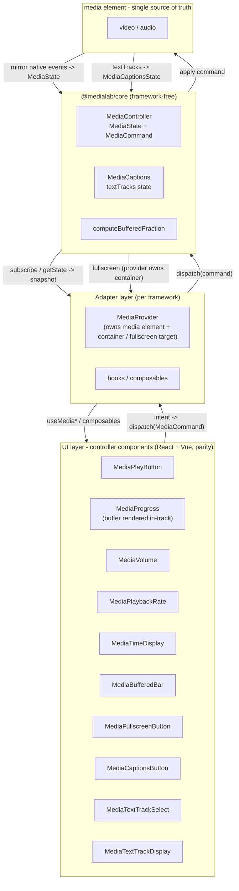

medialab layers a framework-free core under per-framework adapters under presentational components.

**The seam is a store.** `@medialab/core` exposes `subscribe` / `getState` / `dispatch` / `attach` and the `MediaState` / `MediaCommand` types. A framework adds an *adapter* that binds its reactivity to that store; `core` never changes.

- **React** binds with `useSyncExternalStore` + Context.
- **Vue 3** binds with `shallowRef` + effect + `provide`/`inject`.

Fullscreen is a **container-level** concern (handled by the provider), and captions are driven by the element's `textTracks` via a framework-free store. See `docs/architecture.md` for the authoritative map.

## Support matrix

**Media events → state:** `play`/`pause` ✅, `timeupdate` ✅, `durationchange` ✅, `volumechange` ✅, `waiting`/`playing`/`canplay` (buffering) ✅, `ended` ✅, `progress` (buffered) ✅, `error` ✅. **Roadmap:** `ratechange`, `seeking`/`seeked`, `stalled`/`suspend`, `cuechange` (live captions), `addtrack`/`removetrack`, PiP events.

**Capabilities → command:** play/pause (`togglePlay`) ✅, seek (`seek`, buffer in-track) ✅, volume/mute ✅, playback rate ✅, time display ✅, buffered bar ✅, fullscreen ✅, captions (on/off + track + display) ✅. **Roadmap:** live cue refresh (字幕实时刷新), VTT sample, picture-in-picture, language selection, adaptive/live (DASH/HLS), network/buffering badge, publishing build (`tsdown`).
